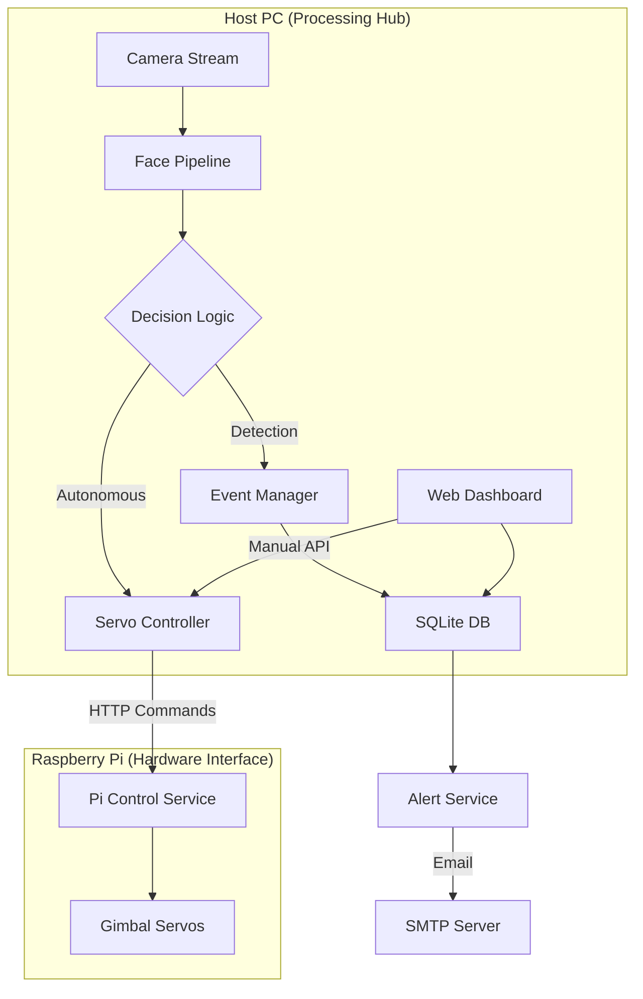

# SecureVision: AI-Powered Servo-Tracking Security System

SecureVision is a real-time face detection and recognition system integrated with a dual-axis servo gimbal for autonomous tracking and manual operator control. Designed as a Final Year Project (FYP), it provides a robust security dashboard for monitoring, event management, and alert notifications.

## Key Features

- **Real-time Detection & Recognition**: Utilizes SCRFD for high-accuracy face detection and ArcFace for identity verification.
- **Autonomous Servo Tracking**: Dynamic PID-inspired adjustment for face recentering using a Raspberry Pi-controlled gimbal.
- **Operator Dashboard**: Clean, responsive UI for live monitoring, event history, and user management.
- **Manual Override**: D-pad and keyboard-based manual servo controls with automatic auto-tracking suppression.
- **Alert System**: Email notifications with snapshots for unauthorised events, featuring intelligent suppression logic.
- **RBAC**: Role-Based Access Control (Admin/Operator) for securing sensitive system settings.

## System Architecture



## Setup & Installation

### 1. Requirements
- Python 3.10+
- Flask, OpenCV, ONNX Runtime
- SQLite3
- Raspberry Pi (optional, for servo functionality)

### 2. Environment Setup
```powershell
# Create virtual environment
python -m venv venv
.\venv\Scripts\activate

# Install dependencies
pip install -r requirements.txt
```

### 3. Configuration
Copy the template env file and adjust variables:
```powershell
cp .env.example .env
```
Ensure you set `SV_CAMERA_SOURCE` (0 for local webcam) and configure `SV_BOOTSTRAP_ADMIN_...` for your first login.

### 4. Database Initialization
The database initializes automatically on first run via `app/db/migrations.py`.

## Usage

### Running the System
```powershell
python -m app.main
```
The dashboard will be available at `http://localhost:8000`.

### Manual Servo Controls
On the dashboard, you can use the on-screen D-pad or **Arrow Keys** to move the gimbal. Using manual controls will automatically disable "Auto-Tracking" to prevent hardware contention.

## Testing
The project includes a comprehensive test suite (Unit and Integration):
```powershell
pytest
```
Recent fixes have aligned `test_servo_logic.py` with actual ML detection models to ensure 100% verification of the tracking math.

---
*Created for FYP 2026.*