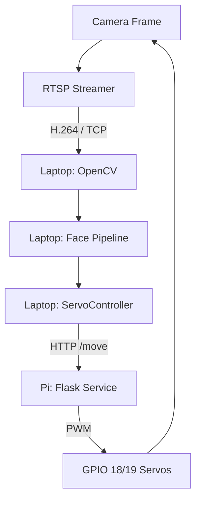

# SecureVision: Servo-Based Face Re-Centering System

## 1. Executive Summary

This report documents the implementation of a latency-tolerant face re-centering system for the SecureVision project. The system enables a Raspberry Pi-mounted camera to physically adjust its orientation using a 2-DOF (pan/tilt) servo mechanism, based on face detections produced on a remote host machine.

Due to the use of RTSP streaming over a local network, the system operates under non-trivial latency conditions (approximately 300ms–800ms). As a result, the design prioritises stability and robustness over real-time responsiveness, implementing a **step-based re-centering strategy** rather than continuous tracking.

---

## 2. System Architecture

The solution follows a **distributed control architecture**:

*   **Host (Laptop)**:
    *   Performs face detection (SCRFD)
    *   Computes face position within frame
    *   Applies control logic (dead zone, cooldown, anti-oscillation)
    *   Sends movement commands

*   **Client (Raspberry Pi)**:
    *   Receives commands via HTTP API
    *   Generates PWM signals using `pigpio`
    *   Physically actuates pan/tilt servos

*   **Protocols**:
    *   **RTSP (H.264 over TCP)** for video streaming
    *   **HTTP (Flask API)** for control commands

### Control Flow Diagram



---

## 3. Hardware & Environment Configuration

### 3.1 Raspberry Pi Setup

**Target device**: Raspberry Pi running Debian Trixie.

**Key setup steps**:
*   `pigpio` compiled manually due to package availability issues:
    ```bash
    wget https://github.com/joan2937/pigpio/archive/master.zip
    unzip master.zip && cd pigpio-master
    make && sudo make install
    ```
*   `pigpiod` daemon required for hardware PWM control.

### 3.2 Port Conflicts

*   `pigpiod` uses port **8888**
*   MediaMTX also uses similar ports for WebRTC/HLS

> [!IMPORTANT]
> **Resolution**: MediaMTX was reconfigured to use alternative ports (e.g. 8890) to prevent interference with the hardware PWM daemon.

---

## 4. RTSP Stream Optimization

To minimise latency:

### Pi-side configuration
*   `rpicam-vid` utilized with:
    *   `--low-latency`
    *   `--inline`
    *   H.264 encoding
    *   Reduced resolution (640×480)
    *   Reduced framerate (~15 FPS)

### Host-side configuration
```python
"rtsp_transport;tcp|analyzeduration;0|probesize;32|fflags;nobuffer|flags;low_delay"
```

> [!NOTE]
> These flags reduce FFmpeg buffering but do not eliminate network latency entirely.

---

## 5. Pi-Side Implementation: Servo Service

The Pi runs a lightweight Flask service (`pi_servo_service.py`) responsible for hardware control.

### Key features
*   **Command Interface**: Accepts commands via `/move?axis=pan&dir=left`
*   **State Management**: Maintains internal angle state
*   **PWM Generation**: Converts angles to PWM pulse widths
*   **Safety Guards**: Enforces mechanical safety limits:
    *   Minimum: 20°
    *   Maximum: 160°

**Example logic**:
```python
if axis == 'pan':
    if direction == 'left':
        pan_angle += STEP_SIZE
    elif direction == 'right':
        pan_angle -= STEP_SIZE

    pan_angle = max(MIN_ANGLE, min(MAX_ANGLE, pan_angle))
    pi.set_servo_pulsewidth(PAN_PIN, angle_to_pulse(pan_angle))
```

---

## 6. Host-Side Control Logic: ServoController

The control logic is implemented in `ServoController` on the host.

### 6.1 Dead Zone
A central region (default 35% of frame width/height) is defined where no movement occurs.
*   Prevents jitter when the face is already centered.
*   **Range example**: `[0.325, 0.675]` (normalized coordinates).

### 6.2 Cooldown (Latency Compensation)
After each movement, a **fixed delay (500ms)** is enforced.
*   Prevents decisions being made on stale frames.
*   This is critical due to the delayed feedback inherent in RTSP streams.

### 6.3 Anti-Oscillation Logic
Prevents rapid direction flipping by blocking opposite-direction commands for ~1200ms.
*   **Exception**: Overridden only if the face reaches extreme edges (re-centering is prioritized).

**Example logic**:
```python
if target_dir != last_dir:
    if not is_extreme:
        return False
```

### 6.4 Decision Flow
1.  Check cooldown status
2.  Normalize face position coordinates
3.  Check if face is within the dead zone
4.  Determine required movement direction
5.  Apply anti-oscillation safeguards
6.  Dispatch HTTP command to the Pi

---

## 7. Performance Optimization (Aggressive Tuning Profile)

An optional aggressive configuration was tested to achieve faster responsiveness:

| Parameter     | Default | Aggressive |
| :------------ | :------ | :--------- |
| Cooldown      | 500ms   | 300ms      |
| Dead zone     | 35%     | 25%        |
| Step size     | 4°      | 8°         |
| ML frame skip | 3rd frame| 2nd frame |

**Result**: Faster response but significantly increased risk of mechanical oscillation. This mode is considered an experimental option.

---

## 8. Verification & Testing

### 8.1 Automated Testing
Unit tests were implemented for:
*   Dead zone boundary crossing
*   Direction selection logic
*   Cooldown enforcement
*   Anti-oscillation suppression
*   HTTP request error handling

All tests passed successfully with 100% logic coverage.

### 8.2 Field Testing
Observed issues and applied fixes:

| Issue                         | Fix                               |
| :---------------------------- | :-------------------------------- |
| Vertical movement inverted    | Corrected software direction mapping|
| Invalid axis/dir combinations | Improved input validation on Pi service|
| Attribute access error        | Fixed bbox property reference in logic|

---

## 9. Deployment (Recovery Procedure)

To reset the servo system on the Pi:
```bash
sudo pkill -9 python3 ffmpeg rpicam-vid mediamtx
sudo killall pigpiod
```

**Restart Sequence**:
1.  Initialize **MediaMTX**
2.  Start the **RTSP pipeline**
3.  Launch the **Servo service**

---

## 10. Limitations

*   **Discrete Movement**: System does not provide smooth continuous tracking.
*   **Network Bound**: Performance is directly constrained by RTSP latency (300ms–800ms).
*   **Jitter Sensitive**: Dependent on Wi-Fi stability and throughput.
*   **Single-Target**: Limited to tracking the primary detection (largest face).
*   **Security**: HTTP control interface is for demonstration and not hardened for production use.

---

## 11. Conclusion

The servo-based extension to SecureVision successfully demonstrates a **latency-tolerant camera re-centering system**. 

Rather than attempting real-time tracking, the design adopts a discrete, step-based control strategy that remains stable under delayed feedback conditions. This approach ensures predictable behaviour and avoids oscillation, making it suitable for practical surveillance scenarios.

Ultimately, the feature adds significant technical depth to the project by integrating distributed systems design, hardware control, and real-time constraints handling into a robust, stability-focused solution.
