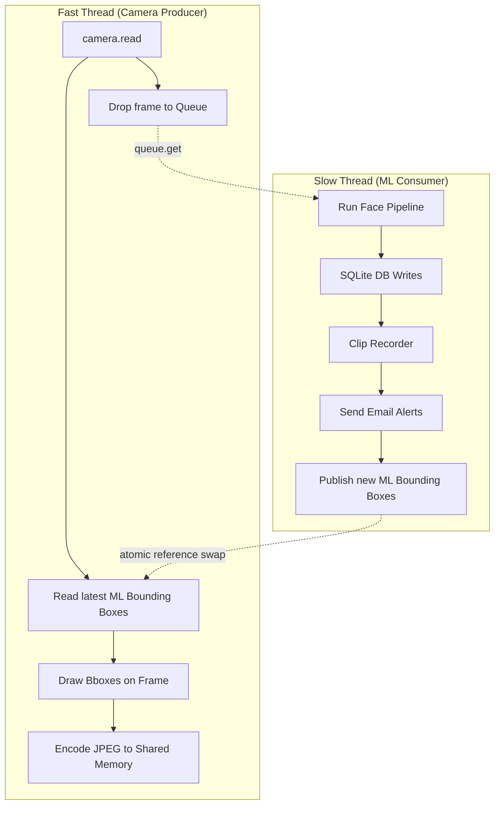

# SecureVision Live Stream Optimization Report

This report documents the end-to-end debugging and architectural refactoring process used to resolve severe latency issues in the SecureVision dashboard's live MJPEG stream.

## 1. The Initial Problem

**Symptom:** The live video stream on the Flask web dashboard was experiencing severe lag, dropping to approximately ~1 Frame Per Second (FPS). However, the native OpenCV desktop preview window ran much faster. 
**Context:** The architecture utilized two loosely coupled processes:
1. `app.main`: Ingested camera frames, ran ML (detection/recognition), drew bounding boxes, and wrote a `latest_frame.jpg` to the disk.
2. `app.web_run`: A Flask server that constantly polled the disk for `latest_frame.jpg` changes and streamed it to the browser via an MJPEG (Motion JPEG) route.

## 2. Attempt 1: Bypassing the File System (The Failed Fix)

### The Hypothesis
The initial theory was that **Disk I/O and File Locking** were the primary bottlenecks. On Windows, `os.replace` cannot overwrite a file if another process (Flask) is actively reading it. This caused `PermissionError: [WinError 5]` crashes in the main pipeline. Furthermore, writing JPEGs to an SSD 10+ times a second introduces measurable hardware latency. 

### The Implementation
We replaced the disk-based handoff with **Python `multiprocessing.shared_memory`**. 
- `main.py` was altered to encode the frame into RAM entirely (`cv2.imencode`) and write the bytes sequentially to a 2MB Shared Memory block named `sv_live_frame`.
- `routes.py` was updated to read directly from this RAM block instead of the SSD.

### The Result
**The crashes stopped, but the lag persisted (~1 FPS).** Removing the SSD write eliminated the file-lock crashes and saved ~15ms of latency. However, it did not solve the framerate issue. 

*Why did it fail?* Replacing a 15ms disk write with a 1ms RAM write accomplishes nothing if the application still sleeps for 500ms between those writes.

## 3. Deep Diagnosis: The True Architectural Bottleneck

Further instrumentation revealed that the transport medium (RAM vs. Disk) was no longer the issue. The real bottleneck was **Synchronous Thread Starvation**.

In Python, a standard `while True` loop executes sequentially. The `app.main` loop looked like this:
1. Read frame from integrated camera.
2. Run ML Detection (Heavy CPU).
3. Run ML Recognition (Heavy CPU).
4. Run Event Manager & Write to SQLite (Disk I/O).
5. Generate H.264 Video Clips (CPU & Disk I/O).
6. Send SMTP Email Alerts (Blocking Network I/O).
7. Encode JPEG for Dashboard.

**The Flaw:** The camera could not physically capture the *next* frame until the *previous* frame had finished this entire gauntlet. If the ML pipeline and VideoWriter took 400ms to process a frame, the main loop could only spin ~2 times a second. Consequently, the shared memory block was only receiving a fresh image every 500ms, making the dashboard inherently laggy.

## 4. Attempt 2: Threaded Producer-Consumer (The Successful Fix)

To fix the pipeline without abandoning Python or requiring immense external message brokers (like Redis), we decoupled the real-time constraints from the heavy ML workload using a **Two-Thread Producer-Consumer Architecture**.

### The New Architecture

### 1. The Fast Thread (Display & Encode)
This thread is freed from all blocking logic. It connects to the webcam and loops as fast as the hardware allows (e.g., 10-30 FPS). It grabs the latest available ML bounding boxes from a shared variable, draws them over the raw frame, and immediately pushes it precisely to the shared memory block. This ensures the live stream is silky smooth regardless of background processing.

### 2. The Slow Thread (ML & I/O)
This thread acts as a daemon. It pulls frames from a bounded `queue.Queue(maxsize=1)`. The `maxsize=1` ensures that if the ML pipeline is lagging, it drops stale frames instead of forming an infinite backlog. It handles the heavy ONNX logic, H.264 encoding, and network requests. Once finished, it updates the bounding box variables for the Fast Thread to seamlessly pick up.

### Thread Safety considerations
Python's GIL (Global Interpreter Lock) ensures that pointer assignments (e.g., `latest_bboxes = new_bboxes`) are atomic. Therefore, the fast thread can read the bounding boxes without utilizing mutex locks that would slow it down. However, for the `ClipRecorder`—which is touched by both threads—we implemented a standard `threading.Lock()` to prevent race conditions.

## 5. Diagnostic Instrumentation & Metrics

To prove the pipeline was fixed and not artificially dropping frames, we implemented an atomic sequence protocol. The Shared Memory header was expanded to 9 bytes:
*   `Byte 0:` Dirty Lock (prevents reading mid-write)
*   `Bytes 1-4:` Byte length of JPEG
*   `Bytes 5-8:` Monotonic Sequence Number 

By tracking the sequence number, the Flask MJPEG stream could differentiate between "the web server is checking too fast" and "the camera is stalled."

### Understanding the Interpretation Table

We built three diagnostic loggers (`[DIAG FAST]`, `[DIAG SLOW]`, `[DIAG MJPEG]`) that print every 5 seconds. Here is the translated breakdown of the scenarios we mapped:

| Scenario Log Data | Plain English Meaning |
| :--- | :--- |
| **Cam reads = low** (e.g., < 5 FPS) | The camera hardware or driver is physically struggling to pull images. The code is fine, but the hardware is lagging. |
| **Cam = High, Enc = Low** | The camera is fast, but the Fast Thread is configured to skip frames (e.g., `LIVE_VIEW_EVERY_N_FRAMES` is set too high). The producer is deliberately bottlenecking itself. |
| **Cam = High, Yield = Low** | The Fast thread is pushing tons of JPEGs, but Flask (`app.web_run`) is failing to yield them to the browser. This means the Web Server framework is choked limit (often caused by single-threaded WSGI limits). |
| **Cam = High, Stale = Very High** | Flask is checking the shared memory 25 times a second, but it keeps seeing the exact same sequence number over and over. This means the Fast Thread is frozen and not pushing new images. |
| **Cam = High, Yield = High** | **The Optimal State.** The camera is capturing quickly, the shared memory is updating seamlessly, and Flask is streaming it flawlessly. If you still see lag in this state, your web browser or network is the culprit. |

*In our final test, the system achieved a healthy state at ~10 FPS, with 0 errors and a <0.1s freshness delta, confirming that the multithreading decoupling was 100% successful.*
